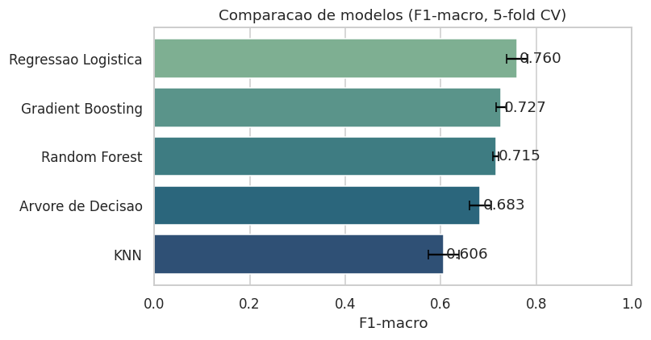
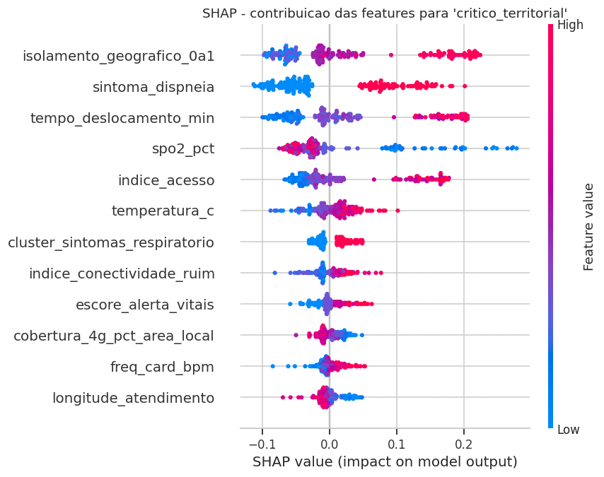

# 🛰️ Medistar — Priorização Inteligente de Atendimento em Telemedicina

**Plataforma de telemedicina e vigilância em saúde para regiões isoladas, com apoio de dados espaciais.**
Pipeline completo de IA/ML que avalia o paciente **dentro do seu território** — cruzando quadro clínico com contexto geográfico, ambiental e de conectividade — para gerar uma priorização de atendimento mais justa em comunidades remotas (ribeirinhas, rurais, indígenas, de floresta).


> 🔗 **App em funcionamento:** **<https://medistare.streamlit.app/>**

> ⚠️ **Aviso:** ferramenta de **apoio à decisão clínica**. Não realiza diagnóstico nem substitui o julgamento de profissionais de saúde.

---

## 📑 Índice
1. [Contexto do problema](#1-contexto-do-problema)
2. [Fonte dos dados](#2-fonte-dos-dados)
3. [Metodologia](#3-metodologia)
4. [Modelos testados](#4-modelos-testados)
5. [Resultados](#5-resultados)
6. [Interpretabilidade com SHAP](#6-interpretabilidade-com-shap)
7. [Deploy e instruções de execução](#7-deploy-e-instruções-de-execução)
8. [Estrutura do repositório](#8-estrutura-do-repositório)
9. [Limitações e ética](#9-limitações-e-ética)
10. [Economia Espacial e ODS](#10-economia-espacial-e-ods)

---

## 1. Contexto do problema

Em regiões isoladas, o risco real de um caso **não depende apenas dos sintomas**, mas também do contexto: distância até o hospital, isolamento geográfico, clima severo e qualidade da conexão. Um quadro de febre moderada é "atenção" em um centro urbano, mas pode ser grave em uma comunidade ribeirinha com hospital a 180 km, chuva intensa e internet instável.

**Formulação de ML:** classificação supervisionada **multiclasse** (4 classes ordinais de gravidade).
**Alvo:** `prioridade_atendimento`

| Classe | Significado |
|---|---|
| `baixo_risco` | Sinais estáveis e fácil acesso |
| `atencao` | Sintomas moderados ou algum fator de risco |
| `alta_prioridade` | Sinais relevantes + dificuldade de acesso |
| `critico_territorial` | Gravidade clínica agravada pelo contexto territorial |

---

## 2. Fonte dos dados

O conjunto de dados é **sintético, gerado com IA generativa**. Antes de gerar os registros, a IA foi orientada a **pesquisar referências reais** — faixas fisiológicas de sinais vitais, distâncias e tempos de deslocamento típicos de comunidades isoladas brasileiras, padrões de conectividade via satélite e variáveis ambientais (enchentes, queimadas, chuva) — de modo que os valores e as **correlações entre as variáveis fossem coerentes com a realidade** clínica e territorial, e não números aleatórios sem sentido. Isso atende ao requisito de **dataset criado por IA generativa**, com folga sobre o mínimo de 1.000 linhas × 10 colunas.

- **`medistar_pacientes_telemedicina_sintetico.csv`** — **1.500 linhas × 45 colunas**, 30 comunidades, 16 UFs, **0 valores faltantes**, 0 duplicatas.
- O rótulo `prioridade_atendimento` foi derivado de um `score_risco_total` sintético (soma ponderada de fatores de risco) com **faixas de corte fixas** — esse score é **removido** do modelo para evitar vazamento (ver [Metodologia](#3-metodologia)).

**Dicionário (resumo por grupo):**

| Grupo | Exemplos de variáveis |
|---|---|
| **Clínico** | `idade`, `sexo`, `gestante`, `comorbidade`, `temperatura_c`, `freq_card_bpm`, `freq_resp_irpm`, `pa_sistolica`, `pa_diastolica`, `spo2_pct`, `duracao_sintomas_dias`, 9 × `sintoma_*`, `cluster_sintomas` |
| **Territorial / ambiental** | `latitude`/`longitude`, `distancia_hospital_km`, `tempo_deslocamento_min`, `isolamento_geografico_0a1`, `risco_enchente_0a1`, `chuva_7d_mm`, `focos_queimada_30d` |
| **Conectividade** | `cobertura_4g_pct_area_local`, `internet_satelite_disponivel`, `latencia_ms`, `perda_pacotes_pct`, `offline_ultimas_24h` |
| **Vigilância coletiva** | `casos_mesmo_cluster_24h`, `alerta_comunitario` |

Distribuição do alvo: `critico_territorial` 552 · `alta_prioridade` 350 · `atencao` 342 · `baixo_risco` 256 (desbalanceamento tratado com `class_weight="balanced"` e avaliação por **F1-macro**).

---

## 3. Metodologia

Pipeline completo de ML (`scikit-learn`), do dado bruto ao deploy.

### 3.1 Tratamento de vazamento (data leakage)
Investigação documentada no código:
- **`score_risco_total` → REMOVIDO.** É a soma usada para *criar* o rótulo (cortes fixos, classes sem sobreposição). Mantê-lo daria acurácia artificial ≈ 100%.
- **`casos_mesmo_cluster_24h` e `alerta_comunitario` → MANTIDOS.** Correlacionam ~0,34 com o score, ou seja, são *parcelas* dele — como temperatura, distância e isolamento também são. Como removemos a **soma**, manter as parcelas individuais **não** é vazamento: é o problema legítimo (o modelo reaprende os pesos). `alerta_comunitario` é derivável de `casos_mesmo_cluster_24h` (alerta = 1 ⟺ casos ≥ 5); a redundância é absorvida pelo Random Forest.

### 3.2 Engenharia de atributos
7 features derivadas, todas a partir de variáveis observáveis na triagem (sem usar score/rótulo):

| Feature | Descrição |
|---|---|
| `escore_alerta_vitais` (0–5) | Nº de sistemas fisiológicos alterados (inspirado em escores tipo NEWS) |
| `hipoxemia` (0/1) | SpO₂ < 92% |
| `carga_sintomatica` (0–9) | Total de sintomas relatados |
| `indice_acesso` | Dificuldade de chegar (distância + tempo + isolamento) |
| `indice_ambiental` | Severidade climática (enchente + chuva + queimadas) |
| `indice_conectividade_ruim` | Precariedade da comunicação (offline + perda + latência + cobertura) |
| `paciente_vulneravel` (0/1) | Idade extrema, gestante ou comorbidade |

O módulo **`medistar_features.py`** é a **fonte única** dessa transformação, importado tanto no treino quanto no app — eliminando divergência treino/inferência (*training/serving skew*).

### 3.3 Seleção de atributos
A seleção de variáveis é feita em duas frentes: (a) **remoção criteriosa por vazamento e por ausência de poder preditivo** — sai o `score_risco_total` (vazamento) e saem identificadores/texto livre (`patient_id`, `community_id`, `data_atendimento`, `municipio`, `hospital_referencia`, `codigo_ibge`); e (b) **análise de importância** via `feature_importances_` do Random Forest e via SHAP, que confirma quais variáveis efetivamente sustentam a decisão (território + sinais vitais no topo). As features de baixa contribuição permanecem porque o Random Forest é robusto a ruído/redundância, sem prejuízo de desempenho.
Observação sobre a SpO₂:
A saturação de oxigênio (`spo2_pct`) possui forte influência no modelo porque representa um sinal clínico crítico, especialmente em quadros respiratórios. Mesmo quando o contexto territorial é favorável, uma SpO₂ muito baixa pode elevar a prioridade do atendimento. Nesse caso, a classe `critico_territorial` deve ser interpretada como uma prioridade crítica clínico-territorial: a decisão considera o paciente e o território, mas sinais clínicos graves podem, isoladamente, justificar alta prioridade.

### 3.4 Pré-processamento e validação
- `ColumnTransformer`: `StandardScaler` (numéricas) + `OneHotEncoder` (categóricas), encapsulado em `Pipeline` (fit **somente** no treino).
- **44 features** finais (41 numéricas + 3 categóricas) após a engenharia.
- Split estratificado **75/25** (1.125 treino / 375 teste).
- **Validação cruzada estratificada 5-fold** com métrica `f1_macro`.

---

## 4. Modelos testados

Cinco técnicas comparadas por validação cruzada (5-fold, F1-macro):

| Modelo | F1-macro (CV) |
|---|---|
| **Regressão Logística** | **0,760 ± 0,022** |
| Gradient Boosting (HistGB) | 0,727 ± 0,011 |
| Random Forest (base) | 0,715 ± 0,006 |
| Árvore de Decisão | 0,683 ± 0,022 |
| KNN | 0,606 ± 0,032 |



**Escolha do modelo final — Random Forest** (otimizado via `GridSearchCV`, F1-macro CV = **0,759**; melhores hiperparâmetros: `n_estimators=300`, `max_features=0.5`, `max_depth=None`, `min_samples_leaf=1`).

> **Nota de honestidade metodológica:** a Regressão Logística (0,760) e o RF otimizado (0,759) **empatam tecnicamente**. Isso é esperado, pois o rótulo sintético segue uma regra **quase-linear** (soma + cortes), cenário em que um modelo linear já vai muito bem. Entre os dois empatados, optou-se pelo Random Forest por (a) desempenho equivalente, (b) robustez a relações **não-lineares** — o que importa em dados *reais* (ver [Limitações](#9-limitações-e-ética)) — e (c) interpretabilidade nativa (importâncias + SHAP `TreeExplainer`).

---

## 5. Resultados

Desempenho do modelo final no **conjunto de teste** (375 pacientes nunca vistos):

| Métrica | Valor |
|---|---|
| Acurácia | **0,712** |
| F1-macro | 0,691 |
| F1-ponderada | 0,709 |
| **ROC-AUC (macro, OvR)** | **0,917** |

**F1 por classe:**

| Classe | F1 |
|---|---|
| `critico_territorial` | **0,856** |
| `baixo_risco` | 0,762 |
| `atencao` | 0,628 |
| `alta_prioridade` | 0,519 |

**Leitura dos resultados:**
- O **ROC-AUC de 0,917** mostra ótima capacidade de separação/ranqueamento, mesmo com acurácia de 0,71.
- O modelo é **mais preciso justamente na classe mais importante** (`critico_territorial`, F1 0,86).
- Os erros se concentram entre **classes vizinhas** na escala (ex.: `atencao` ↔ `alta_prioridade`), o tipo de erro menos perigoso — confirmado na matriz de confusão.

Rodar `python medistar_modelo.py` regenera o conjunto completo de **7 figuras** na pasta `figuras_medistar/`: distribuição do alvo, comparação de modelos, matriz de confusão, curvas ROC, F1 por classe, importância de variáveis e resumo SHAP.

---

## 6. Interpretabilidade com SHAP

Usamos **SHAP** (`TreeExplainer`) em dois níveis:

- **Global** (figura abaixo): contribuição das features para a classe `critico_territorial`. Pesam mais o **contexto territorial** (`isolamento_geografico`, `tempo_deslocamento`, `indice_acesso`) combinado a sinais clínicos (`spo2_pct`, `sintoma_dispneia`, `temperatura_c`) — exatamente a tese do Medistar: **o território importa tanto quanto o sintoma**.
- **Local (no app):** para cada paciente avaliado, o app mostra os fatores que empurraram a decisão para a classe prevista. Validação real (paciente idoso, SpO₂ 86%, isolado, em surto → `critico_territorial`): os principais fatores SHAP foram `isolamento_geografico`, `tempo_deslocamento` e a feature derivada `indice_acesso`.



---

## 7. Deploy e instruções de execução

A solução é publicada como app **Streamlit** (`app.py`) de **telemedicina domiciliar** — sem deslocamento de equipe. O paciente (ou cuidador) registra sintomas e medições de **dispositivos domésticos / sensores IoT** (oxímetro de dedo, termômetro e, quando disponível, medidor de pressão). Os dados de **território e conectividade** fazem parte do dataset e, no app, ficam **editáveis para simulação** — no produto final viriam automaticamente da plataforma (satélite/sensores), conforme a [seção 10](#10-economia-espacial-e-ods). Saída: prioridade gerada + confiança + probabilidade por classe + explicação SHAP local. Os sinais vitais que exigem equipamento ficam em grupos opcionais (toggles): se o paciente não tiver oxímetro/termômetro ou medidor de pressão, o modelo prioriza por sintomas + contexto territorial, sinalizando confiabilidade menor.

🔗 **Aplicação em funcionamento:** **<https://medistare.streamlit.app/>**

### Execução local
```bash
# 1. Ambiente
python -m venv .venv && source .venv/bin/activate   # Windows: .venv\Scripts\activate
pip install -r requirements.txt

# 2. Treinar o modelo (gera medistar_modelo.joblib e figuras_medistar/)
python medistar_modelo.py

# 3. Subir o app
streamlit run app.py
```
---

## 8. Estrutura do repositório

```
.
├── app.py                                          # aplicação Streamlit (deploy)
├── medistar_modelo.py                              # treino + avaliação + serialização
├── medistar_features.py                            # engenharia de atributos (treino + app)
├── medistar_modelo.joblib                          # modelo treinado + schema de inferência
├── medistar_pacientes_telemedicina_sintetico.csv   # dataset sintético (gerado por IA)
├── requirements.txt
├── 02_comparacao_modelos.png                       # figura: comparação de modelos
├── 07_shap_summary.png                             # figura: resumo SHAP (classe crítica)
└── README.md
```

> Ao rodar `python medistar_modelo.py`, a pasta `figuras_medistar/` é criada com o conjunto completo das 7 figuras da avaliação.

---

## 9. Limitações e ética

1. **Dado sintético com rótulo derivado de regra.** A prioridade veio de cortes sobre o `score_risco_total`. O score foi **removido** para evitar vazamento; o modelo "redescobre" a lógica pelas parcelas e atinge ~71% — saudável e honesto para dados simulados.
2. **Em produção não haveria fórmula limpa.** A prioridade real viria de decisões médicas, desfechos e histórico, com muitos fatores interagindo de forma não-linear — onde um modelo como o RF agrega valor sobre uma regra manual.
3. **Apoio à decisão, nunca substituto.** Uso real exige validação com dados reais e revisão ética/clínica.

---

## 10. Economia Espacial e ODS

**Conexão com a Indústria Espacial:** o Medistar depende de ativos orbitais para funcionar em regiões sem infraestrutura terrestre — **conectividade via satélite** (transmissão de sinais vitais e sincronização), **dados geoespaciais** (`latitude`/`longitude`, isolamento, distância), e **sensoriamento remoto** para variáveis ambientais (`risco_enchente`, `focos_queimada`, `chuva_7d_mm`). É um caso de tecnologia espacial resolvendo um problema na Terra.

> **Escopo deste trabalho:** neste MVP, as fontes espaciais são **representadas pelo dataset sintético** (que codifica distância, isolamento, conectividade, risco de enchente etc.). A **integração automática** com satélite/sensoriamento remoto é a **arquitetura-alvo do produto** — não uma funcionalidade implementada aqui. O foco da entrega é o **pipeline de IA/ML**: dados → pré-processamento → modelos → validação → SHAP → deploy.

**ODS:** 3 (Saúde e Bem-Estar) · 9 (Indústria, Inovação e Infraestrutura) · 10 (Redução das Desigualdades) · 11 (Comunidades Sustentáveis) · 13 (Ação Climática).

---

*Projeto desenvolvido para a disciplina **Generative AI for Engineering** — Global Solution.*
